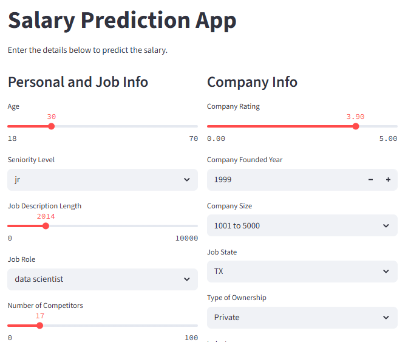
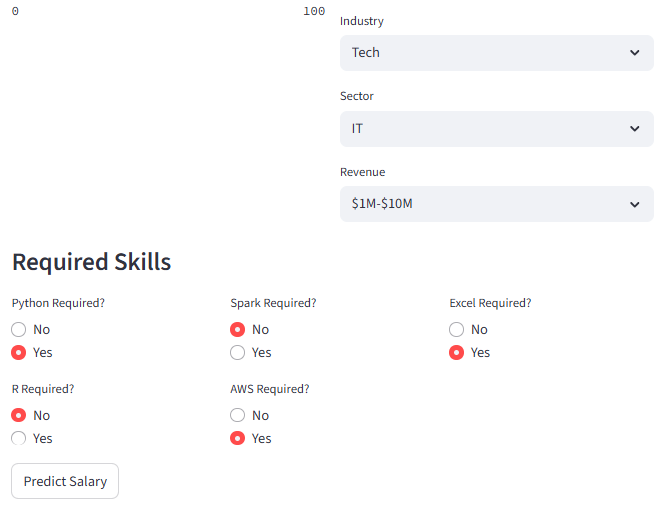
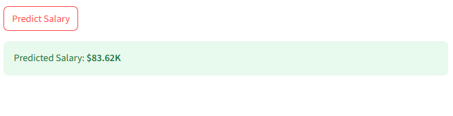

# Salary Prediction App

This project predicts the average salary for a given job using machine learning. Users can input job and company details via a Streamlit web application, and the model will provide a salary estimate based on the provided information.
---

## Project Overview

- **Objective:** Predict average salary for job postings using attributes like job role, company size, required skills, seniority, etc.
- **Dataset:** The dataset used for this project is from Kaggle: [Jobs Dataset from Glassdoor](https://www.kaggle.com/datasets/thedevastator/jobs-dataset-from-glassdoor)
- **Target Variable:** The target variable for this project is the average salary(avg_salary) of the job postings.
- **Models Tested:** The following models were tested for this project:
  - Linear Regression
  - Random Forest Regressor
  - Gradient Boosting Regressor
  - XGBoost Regressor
- **Final Model:** The final model selected for deployment is the Random Forest Regressor(best R^2 score of 0.781).

### Prerequisites
- Python 3.7 or higher
- Streamlit
- Scikit-learn
- Pandas
- Numpy

## Features Used
- Age
- Company Rating
- Company Founded Year
- Seniority Level
- Python Required
- R Required
- Spark Required
- AWS Required
- Excel Required
- Number of Competitors
- Job Description Length
- Job Role
- Company Size
- Job State
- Type of Ownership
- Industry
- Sector
- Revenue

## Running the Application
1. Clone the repository or download the files.
2. Ensure the following files are present in your project folder:
    - `app.py`
    - `rfr_prediction_model.pkl`
    - `seniority_encoder.pkl`
    - `training_columns.pkl`
    - `scaler.pkl`
3. Open command prompt or terminal and navigate to the project folder.
4. Run the streamlit app: `streamlit run app.py`
5. A browser window will open where you can input job and company details to get salary predictions.

## Screenshots

## Model Details
1. Preprocessing
- Dropped irrelevant columns
- Label encoding for Seniority Level
- One hot encoding for categorical features
- Feature scaling using StandardScaler
2. Model Comparison: Random Forest outperformed other models with the highest R² score of 0.781.
3. Cross-validation: Mean R² ~ 0.67
4. Hyperparameter Tuning used RandomizedSearchCV for optimizing model parameters.

## Conclusion
The Random Forest Regressor was selected as the best performing model with R² score of 0.781. After preprocessing, and hyperparameter tuning, the model provides accurate salary predictions. Finally, the model was deployed as a Streamlit web application, allowing users to predict salaries for different job postings.

## Author
Arati Khatri

